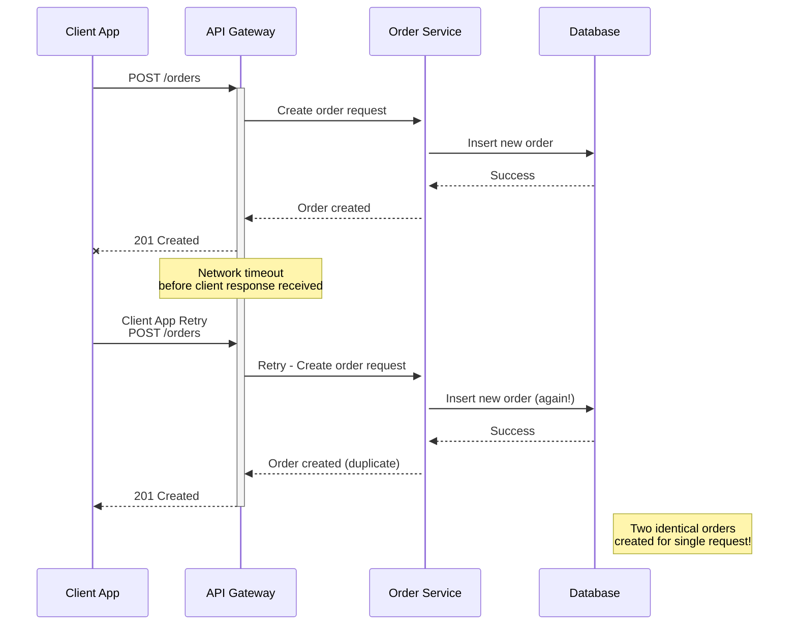
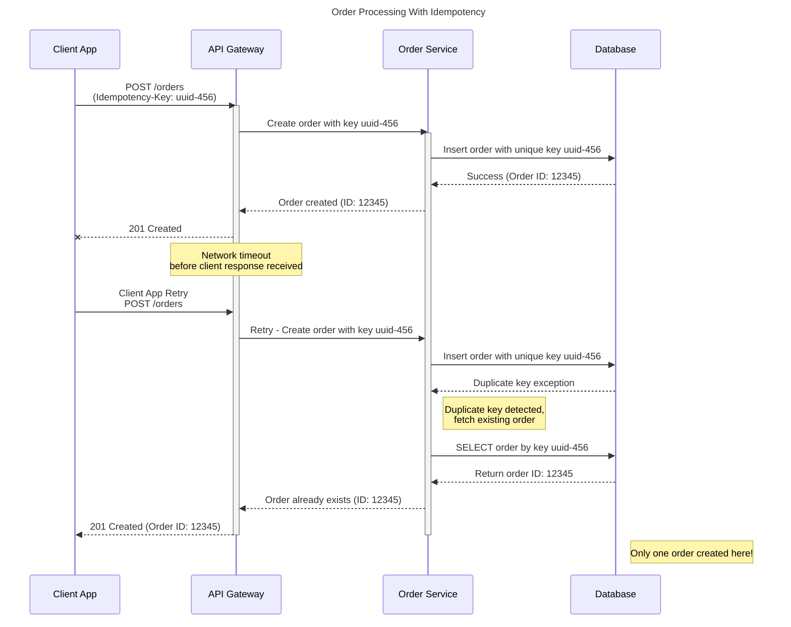
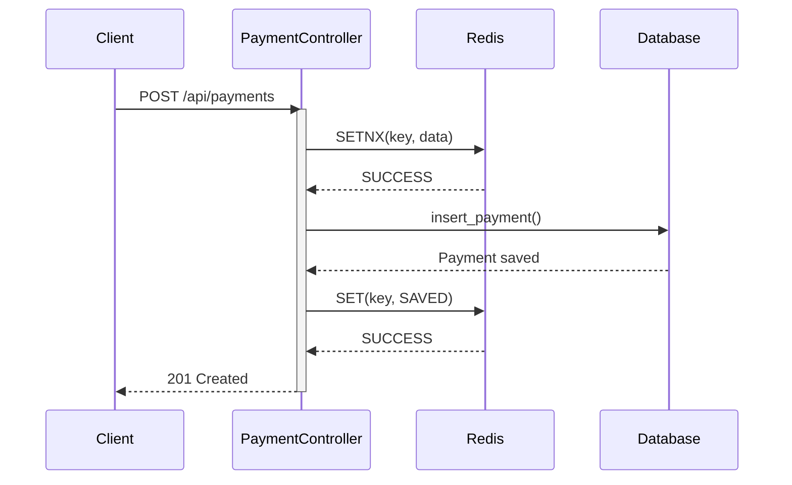

# Introduction

Throughout my career as a software engineer, I've frequently encountered even senior engineers implementing idempotent APIs incorrectly or making unnecessary technical decisions that complicate systems without real benefit. This blog post is written to help senior engineers and technical leads understand the right way to implement idempotency, avoid common pitfalls, and make informed architectural choices.

To illustrate why idempotency matters, consider the following scenario:

Imagine a situation where you're transferring money from your bank account to another account. During the transfer, a network problem causes a timeout, and as a user, you click the "Transfer" button again. The second attempt succeeds, but to your horror, you discover your account has been debited twice for the same transaction. This unpleasant experience is exactly what API idempotency aims to prevent.

In distributed systems and APIs, idempotency ensures that multiple identical requests have the same effect as a single request. This property is crucial for building reliable systems, especially when handling financial transactions, order submissions, or any operation where duplicates could cause serious problems.

In this article, we'll explore how to properly implement idempotent APIs to safeguard your systems against unintended duplicate operations.

# Understanding Idempotency

## What Makes an API Idempotent?

An idempotent API exhibits several key characteristics:

1. **Same Outcome Guarantee**: Multiple identical requests produce the same state as a single request would have produced.
2. **Safe Repetition**: Requests can be safely repeated without causing unintended side effects. This means identical request should not change or add any additional behavior to the resource that previously touched or created. E.g If I request identical create payment API five times, then payment should only be created once.

## Idempotency by HTTP Method

HTTP methods have inherent idempotency properties:

<div style="overflow-x:auto; margin-bottom:1em;">
<table style="border-collapse:collapse; width:100%; border:1px solid #ccc;">
  <thead>
    <tr style="background:#000;">
      <th style="border:1px solid #ccc; padding:8px;">Method</th>
      <th style="border:1px solid #ccc; padding:8px;">Idempotent?</th>
      <th style="border:1px solid #ccc; padding:8px;">Notes</th>
    </tr>
  </thead>
  <tbody>
    <tr>
      <td style="border:1px solid #ccc; padding:8px;">GET</td>
      <td style="border:1px solid #ccc; padding:8px;">Yes</td>
      <td style="border:1px solid #ccc; padding:8px;">Retrieving data has no side effects</td>
    </tr>
    <tr>
      <td style="border:1px solid #ccc; padding:8px;">HEAD</td>
      <td style="border:1px solid #ccc; padding:8px;">Yes</td>
      <td style="border:1px solid #ccc; padding:8px;">Similar to GET but returns only headers</td>
    </tr>
    <tr>
      <td style="border:1px solid #ccc; padding:8px;">OPTIONS</td>
      <td style="border:1px solid #ccc; padding:8px;">Yes</td>
      <td style="border:1px solid #ccc; padding:8px;">Returns communication options</td>
    </tr>
    <tr>
      <td style="border:1px solid #ccc; padding:8px;">PUT</td>
      <td style="border:1px solid #ccc; padding:8px;">Yes</td>
      <td style="border:1px solid #ccc; padding:8px;">Replaces target resource with the request payload</td>
    </tr>
    <tr>
      <td style="border:1px solid #ccc; padding:8px;">DELETE</td>
      <td style="border:1px solid #ccc; padding:8px;">Yes</td>
      <td style="border:1px solid #ccc; padding:8px;">Resource remains deleted after first successful call</td>
    </tr>
    <tr>
      <td style="border:1px solid #ccc; padding:8px;">POST</td>
      <td style="border:1px solid #ccc; padding:8px;">No</td>
      <td style="border:1px solid #ccc; padding:8px;">Generally creates new resources/entries with each call</td>
    </tr>
    <tr>
      <td style="border:1px solid #ccc; padding:8px;">PATCH</td>
      <td style="border:1px solid #ccc; padding:8px;">No*</td>
      <td style="border:1px solid #ccc; padding:8px;">Depends on the implementation (*can be made idempotent)</td>
    </tr>
  </tbody>
</table>
</div>

Understanding these properties is essential for designing reliable APIs, especially in distributed systems where network failures and retries are common occurrences.

# Why Idempotency Matters

## Reliability in Unreliable Environments

Network failures are inevitable in distributed systems. Connections drop, requests timeout, and responses get lost. Without idempotency, each retry attempt could potentially:

- Create duplicate records
- Process payments multiple times
- Apply the same state change repeatedly

## Technical Implementation Challenges

To visualize the challenges of non-idempotent operations in distributed systems, consider this scenario:



With proper idempotency implementation, this scenario would be prevented:



These diagrams illustrate why idempotency is crucial for maintaining data integrity during network failures or client retries.

# Implementation Strategies 

## Using Idempotency Keys

When discussing "identical requests," we need a reliable mechanism to identify them. This is where idempotency keys come in.

An idempotency key is a unique identifier associated with a specific client request that allows the server to detect and handle duplicate requests properly. Here's how it works:

1. **Client Responsibility**: The client generates a unique idempotency key (typically a UUID with sufficient entropy to avoid collisions)
2. **Request Header**: The key is included in the request header, often as `Idempotency-Key` or `X-Idempotency-Key`
3. **Server Processing**: The server uses this key to determine if it's processing a new request or a retry of a previous request

Example request:

<details>
<summary>Click to view example HTTP request</summary>

<div class="language-http highlighter-rouge"><div class="highlight"><pre class="highlight"><code>POST /api/payments HTTP/1.1
Host: example.com
Content-Type: application/json
Idempotency-Key: 123e4567-e89b-12d3-a456-426614174000

{
  "amount": 100.00,
  "currency": "USD",
  "destination": "account-456"
}
</code></pre></div></div>

</details>

## When Should Clients Regenerate Idempotency Keys?

For user-facing APIs, idempotency key generation is typically guided by the application's user experience. If a create payment request consistently results in timeouts or server errors, redirecting the user to the payments dashboard allows them to verify whether the payment was created. If the payment does not appear in the dashboard after a reasonable delay, it is generally safe to generate a new idempotency key and retry the operation.
From an API system perspective, such as with Stripe's Create Payment API, the idempotency key is often derived from an internal identifier generated by your database and then passed in the Stripe API's idempotency key header. This approach ensures that the same key is used for all retries until the request succeeds.

# Approaches

In this section, I will give you some of the implementation approaches that I have found during my careers as software engineer and also common pitfalls. But before that I want to define API requirements and here I will simulate `POST /api/payments` API idempotency handling.

## API Requirements

**1.** The client can send `POST /api/payments` request with both an idempotency key and an API key for authentication.

<details>
<summary>Click to view API request/response example</summary>

<div class="language-http highlighter-rouge"><div class="highlight"><pre class="highlight"><code>POST /api/payments HTTP/1.1
Host: example.com
Content-Type: application/json
Idempotency-Key: 123e4567-e89b-12d3-a456-426614174000
Api-Key: Merchant-Server-Key-5fc07d0d-3469-46a7-9e76-029c1c4cb002

Request Body:
{
  "amount": 100.00,
  "currency": "USD",
  "destination": "account-456"
}

Response:
{
    "payment_id": "payment-id-1"
}
</code></pre></div></div>

</details>

**2.** The API must allow clients to retry requests with the same idempotency key during network instability or server errors, ensuring no duplicate payments occur. Each identical request with the same idempotency key is processed as a single operation.

**3.** Idempotency keys are typically valid only for a limited period—commonly one day—to balance reliability and resource usage. This practice helps prevent indefinite storage of keys and aligns with industry standards; for example, [Stripe documentation](https://docs.stripe.com/api/idempotent_requests) specifies that idempotency keys are pruned after 24 hours.

**4.** If a subsequent request arrives with the same idempotency key but a different payload or different user, the system must respond with HTTP 409 Conflict.

**5.** If the server encounters an internal error (such as a database failure), it should return HTTP 500. The client may safely retry the request with the same idempotency key, expecting the operation to succeed once the error is resolved.


## Approach 1 - Using Redis

In my experience, many engineers instinctively turn to Redis as a solution for this problem. While not inherently wrong, it's often implemented incorrectly. Let's examine a common example:

```python
class PaymentController:
    # redis & db initiated
    def create_payment(self, user_id, idempotency_key, amount, currency, source_account_wallet, destination_account_wallet):
        if self.redis.is_exist(idempotency_key):
            raise DuplicateKeyException()
        value = ""
        time_to_live_seconds = 84600
        self.redis.set(idempotency_key, value, time_to_live_seconds)
        response = self.db.insert_payment(user_id, amount, currency, source_account_wallet, destination_account_wallet)
        self.redis.set(idempotency_key, response, time_to_live_seconds)
        return response
```

What's the flaw in the code above? If you identified the race condition around `if self.redis.is_exist(idempotency_key):`, you're correct. Imagine two simultaneous requests checking for the key's existence. Since the key hasn't been set yet, neither request triggers the error, both proceed to set the idempotency key to an empty string, and the payment gets duplicated. Shockingly, I encountered this similar code running in production, written by another engineer.

How can we solve this? Redis provides atomic operations, meaning commands like [SET WITH NX / SETNX](https://redis.io/docs/latest/commands/set/) (Set if Not Exists) are executed in a single step, preventing race conditions. By using SETNX, we ensure that only the first request with a given idempotency key will proceed, and any subsequent requests with the same key will be safely ignored or handled as duplicates.

Here's how you can revise the code to use SETNX for atomic idempotency key handling:
```python
class PaymentController:
    ....
    # redis & db initiated in constructor
    def create_payment(self, user_id, idempotency_key, amount, currency, source_account_wallet, destination_account_wallet):
        time_to_live_seconds = 84600
        value = ""
        result = self.redis.setnx(idempotency_key, value, time_to_live_seconds)
        if result == None:
            # Key already exists, check if processing is complete
            raise DuplicateKeyException()
        response = self.db.insert_payment(user_id, amount, currency, source_account_wallet, destination_account_wallet)
        self.redis.set(idempotency_key, response, time_to_live_seconds)
        return response
```
The revised code above satisfies API requirements 1, 2, and 3. However, requirements 4 and 5 are not fully addressed. If a database error occurs, the user may receive a DuplicateKeyException, without clarity on whether the payment was actually saved. Since errors can happen before or after data is persisted, this ambiguity may confuse API consumers. Next, I will provide a more robust and ideal code example for handling idempotency with Redis. You can take a look first on the `create_payment` method.

```python
import hashlib
import uuid
import json

class RequestConflict(Exception):
    pass

class DatabaseDuplicateKeyException(Exception):
    pass

class Payment: # this is model that will represent table
    def __init__(self, payment_id, user_id, idempotency_key, amount, currency, source_account_wallet, destination_account_wallet):
        self.user_id = user_id
        # exclude idempotency_key from database storage as it's only used for Redis caching
        self.idempotency_key = idempotency_key  
        self.amount = amount
        self.currency = currency
        self.source_account_wallet = source_account_wallet
        self.destination_account_wallet = destination_account_wallet
         # payment_id field requires unique constraint in database (MySQL, PostgreSQL, MongoDB, etc.)
        self.payment_id = payment_id  

    def get_hash(self):
        # This hash data can be extended to include date (not datetime) if you want to prevent identical payloads with different dates
        # But I think current implementation provides sufficient uniqueness for request validation
        data = f"{self.user_id}:{self.amount}:{self.currency}:{self.source_account_wallet}:{self.destination_account_wallet}"
        return hashlib.sha256(data.encode("utf-8")).hexdigest()
    
    @staticmethod
    def serialize(payment):
        return json.dumps({
            'payment_id': str(payment.payment_id),
            'user_id': payment.user_id,
            'idempotency_key': payment.idempotency_key,
            'amount': payment.amount,
            'currency': payment.currency,
            'source_account_wallet': payment.source_account_wallet,
            'destination_account_wallet': payment.destination_account_wallet
        })
    
    @staticmethod
    def deserialize(payment_data):
        data = json.loads(payment_data)
        return Payment(
            payment_id=data['payment_id'],
            user_id=data['user_id'],
            idempotency_key=data['idempotency_key'],
            amount=data['amount'],
            currency=data['currency'],
            source_account_wallet=data['source_account_wallet'],
            destination_account_wallet=data['destination_account_wallet']
        )

class PaymentController:
    def __init__(self, redis_client, db_client):
        self.redis = redis_client
        self.db = db_client
    
    def create_payment(self, user_id, idempotency_key, amount, currency, source_account_wallet, destination_account_wallet):
        time_to_live_seconds = 86400
        # Generate unique payment ID that serves multiple purposes:
        # 1. Acts as the primary identifier for this payment
        # 2. Provides database-level duplicate detection via unique constraint
        # 3. Enables safe retry operations when combined with idempotency key
        payment_id = str(uuid.uuid4()) 


        # Isolate idempotency key by user to prevent cross-user conflicts
        # This ensures different users can use the same idempotency key safely
        isolated_idempotency_key = f"{user_id}:{idempotency_key}"
        payment = Payment(payment_id, user_id, isolated_idempotency_key, amount, currency, source_account_wallet, destination_account_wallet)
        value = ("SAVING", payment.get_hash(), Payment.serialize(payment))

        # Redis try to set the key value, NX means if it is already exist, it will not update the value and will return None
        # If it is the first time the value is set, then it will return "OK"
        result = self.redis.setnx(isolated_idempotency_key, value, time_to_live_seconds)
        
        if result is None:
            # Key already exists - validate request consistency and check completion status
            status_from_redis, hash_from_redis, payment_serialized = self.redis.get(isolated_idempotency_key)
            payment = Payment.deserialize(payment_serialized)
            
            # Verify request payload matches original request using hash comparison
            if hash_from_redis != payment.get_hash():
                raise RequestConflict("409 HTTP Request Conflict")
            if status_from_redis == "SAVED":
                return payment
        
        try:
            response = self.db.insert_payment(payment)
            value = ("SAVED", payment.get_hash(), Payment.serialize(payment))
            self.redis.set(isolated_idempotency_key, value, time_to_live_seconds)
            return response
        except DatabaseDuplicateKeyException:
            # Payment was successfully inserted by a concurrent request
            # Update Redis state and return the payment object
            response = self.db.get_payment(payment.payment_id)
            if response.get_hash() != payment.get_hash():
                # Edge case: UUID collision with different payment data for the same user_id
                # This scenario is extremely unlikely given UUID's entropy (1 in 2^122 chance)
                # Manual Resolution: Remove idempotency key from Redis to allow client retry with new payment_id
                raise RequestConflict("409 HTTP Request Conflict")
            value = ("SAVED", payment.get_hash(), Payment.serialize(payment))
            self.redis.set(isolated_idempotency_key, value, time_to_live_seconds)
            return payment
```

I would say the create payment method is now more robust than before. Let's analyze several failure scenarios to verify its resilience. But before that let's see the happy flow diagram below:



### Approach 1 - Failure Case Analysis

Based on the sequence diagram above, each arrow (representing request or response flows) can be a potential point of failure. Let's examine five critical failure scenarios:

1. **Case 1 - Redis SETNX Request Never Reaches Redis**  
If the request to Redis times out or fails to arrive, the operation will simply return a timeout or connection error. No data has been saved at this point, making it safe to retry.

2. **Case 2 - Redis SETNX Request Succeeds but Response is Lost**  
When the request reaches Redis successfully but the response is lost due to network issues, the client receives a timeout or connection error. However, the idempotency key has already been saved in Redis with "SAVING" status, setting up the foundation for proper retry handling.

3. **Case 3 - SETNX Returns Null (Key Already Exists)**  
This occurs when another request has already set the key (possibly from a previous retry in Case 2). The system validates request consistency by comparing the hash of the current request with the stored hash. If they don't match, it returns a conflict error. If they match, the system checks the status: if "SAVED", it returns the existing payment; if still "SAVING", it proceeds with database operations.

4. **Case 4 - SETNX Succeeds but Database Operation Fails**  
When the key is successfully set but database saving fails due to network issues, there are two possibilities: the data might have been saved or not. Both scenarios are safely retryable. If the data was already saved, the next retry will trigger a database duplicate key error due to the payment_id constraint (since we store the payment_id in Redis). We catch this error and handle it appropriately.

5. **Case 5 - Database Save Succeeds but Redis Status Update Fails**  
After successfully saving to the database, updating the status to "SAVED" in Redis might fail. This scenario is completely safe to retry from the user's perspective, as the payment has already been persisted.

### Approach 1 - FAQ

1. **Q1: Why do we need to generate payment_id upfront? What happens if the payment ID is generated by the database (e.g., AUTO_INCREMENT SQL)? Can we delegate ID generation to the database or insert_payment method?**

    <details>
    <summary>Click to view answer</summary>

    We explored this approach in the previous Redis code example. While it can fulfill API requirements 1, 2, and 3, it fails to address requirements 4 and 5. To satisfy all API requirements, we need a mechanism to detect duplicates at the database layer, which requires generating the payment_id before saving to Redis.

    </details>

2. **Q2: What happens when payment ID generation conflicts with existing payment data?**

    <details>
    <summary>Click to view answer</summary>

    This represents an edge case of UUID collision with different payment data for the same user_id. This scenario is extremely unlikely given UUID's entropy (1 in 2^122 chance). The resolution involves removing the idempotency key from Redis to allow the client to retry with a new payment_id. For comprehensive ID generation strategies that minimize or eliminate collision risks, see my detailed article <a href="https://wildansupernova.github.io/software-engineering/2025/07/12/Id-Generations.html">here</a>.

    </details>

3. **Q3: Why don't we use the database directly? Why do we need Redis?**

    <details>
    <summary>Click to view answer</summary>

    I present the Redis approach first to demonstrate a common practice I've encountered in production environments during my careers, where many engineers implement Redis-based idempotency incorrectly. The key advantage of Redis is its built-in TTL (Time To Live) functionality, which elegantly fulfills API requirement #3 regarding idempotency key expiration after one day. This eliminates the need for additional background workers to manage key expiration, providing a cleaner and more efficient solution.

    </details>


## Approach 2 - Using Database

You might be wondering from the first approach, "why don't we just use the database directly to save the idempotency key?" While Redis/in-memory cache solutions are common in production settings, database-based approaches are equally valid. I will discuss the pros and cons of both approaches later. During my career, I encountered an engineer who proposed similar code to the example below, which unfortunately contained a critical flaw.

```python
class PaymentController:    
    def create_payment(self, user_id, idempotency_key, amount, currency, source_account_wallet, destination_account_wallet):
        if self.db.find_payment_by_idempotency_key(idempotency_key) != None:
            raise DuplicateKeyException()
        response = self.db.insert_payment(user_id, idempotency_key, amount, currency, source_account_wallet, destination_account_wallet)
        return response
```

The code above is flawed because it suffers from a race condition. Consider a scenario where two identical requests with the same idempotency key call `self.db.find_payment_by_idempotency_key` simultaneously, and both return None. Both requests will then proceed to save the data, resulting in duplicate entries. To fulfill API requirements 1, 2, 3, 4, and 5, we can revise the code as shown below:

```python
class Payment: # this is model that will represent table
    def __init__(self, payment_id, user_id, idempotency_key, amount, currency, source_account_wallet, destination_account_wallet):
        # ID can be generated by database auto-increment properties or UUID
        self.id = UUID()
        self.user_id = user_id
        # idempotency_key will have unique index constraint in database to prevent duplicate inserts
        self.idempotency_key = idempotency_key  
        self.amount = amount
        self.currency = currency
        self.source_account_wallet = source_account_wallet
        self.destination_account_wallet = destination_account_wallet
        self.created_at = Now()

    def get_hash(self):
        # Hash data can be extended to include date (not datetime) to prevent identical payloads with different dates
        # Current implementation provides sufficient uniqueness for request validation
        data = f"{self.user_id}:{self.amount}:{self.currency}:{self.source_account_wallet}:{self.destination_account_wallet}"
        return hashlib.sha256(data.encode("utf-8")).hexdigest()

class PaymentController:
    def __init__(self, redis_client, db_client):
        self.redis = redis_client
        self.db = db_client
    
    def create_payment(self, user_id, idempotency_key, amount, currency, source_account_wallet, destination_account_wallet):
        # Isolate idempotency key by user to prevent cross-user conflicts
        # This ensures different users can use the same idempotency key safely
        isolated_idempotency_key = f"{user_id}:{idempotency_key}"
        payment = Payment(user_id, isolated_idempotency_key, amount, currency, source_account_wallet, destination_account_wallet)
        
        try:
            response = self.db.insert_payment(payment)
            return response
        except DatabaseDuplicateKeyException:
            response = self.db.get_payment(payment.payment_id)
            if response.get_hash() != payment.get_hash():
                # Validate that users haven't reused the same idempotency key with different payload
                raise RequestConflict("409 HTTP Request Conflict")
            return payment
```

In the code above, we eliminate the need to check if a payment with the same idempotency key already exists because the unique index constraint provides this protection. To complete the solution, we need a background worker that periodically removes expired idempotency keys. This worker can filter records by `created_at` and `idempotency_key IS NOT NULL` to identify payments with unexpired idempotency keys, then set the `idempotency_key` field to `NULL` for expired entries. 

### Approach 2 - Failure Case Analysis
Failure scenarios for the database approach are straightforward:

1. **Service crashes after saving data but before responding to the client:**
   - The client can safely retry the request.
   - On retry, the service detects the duplicate key and returns a successful response, guaranteeing no duplicate payment is created.

2. **Service crashes before saving data:**
   - No data is persisted, so a retry simply processes the request as new.
   - There is no risk of duplicate records.

### Approach 2 - FAQ 
1. **Q1: Is this it? Any fatal failure case we must consider?**

    <details>
    <summary>Click to view answer</summary>

    A critical failure case arises in high-availability (HA) setups, such as Patroni for PostgreSQL. If the master node fails, the system may automatically promote a replica to master. Imagine a scenario where payment data is saved on the master but hasn't yet replicated to the replica. If the replica is promoted to master and the client retries the request, it could lead to conflicts when the original master recovers. This requires manual reconciliation, especially if downstream services (e.g., payment gateways) have already been called.

    To mitigate this, you can choose one of these:
    - Enable synchronous replication for at least one replica to ensure data consistency before promotion. However, this increases latency.
    - Disable automatic HA failover or ensure the replica's replication lag is zero before promotion. This approach prioritizes consistency but may result in downtime.

    This trade-off reflects the CAP theorem: in a network partition, you must choose between availability and consistency. Opting for consistency ensures data integrity but may cause downtime, while prioritizing availability risks data inconsistency. Choose based on your system's requirements.

    </details>

# Conclusion and Tips to Choose

Both approaches are viable solutions and are used in production environments. Below are the pros and cons of each approach:

1. **Approach 1 - Redis**
    - **Pros**: 
        - Simplifies idempotency key management with built-in Time to Live (TTL) functionality.
        - Faster lookups from memory, reducing latency.
    - **Cons**: 
        - Adds complexity to the system.
        - Introduces an additional point of failure (Redis) alongside the database.

2. **Approach 2 - Direct Database Idempotency Solution**
    - **Pros**: 
        - Simpler architecture with only one point of failure (the database).
        - Adding a background worker for key expiration does not significantly increase complexity.
    - **Cons**: 
        - May require additional database resources to handle idempotency key storage and expiration.
        - Potentially slower compared to in-memory solutions like Redis, especially under high load. If you consider adding redis is more cheap than applying vertical scaling to the database under that load, then you migh be want to consider redis approach.

From a practical perspective, starting with the second approach is often preferable due to its simplicity and ease of maintenance. As load increases, we can do vertical scaling by adding more resources. Modern cloud solutions, such as AWS EC2 i7ie.48xlarge, offer substantial capacity with up to 16 × 7,500 GB NVMe SSD (120 TB total), 192 vCPUs, and ~1536 GiB RAM, which can handle most use cases. However, if your use case exceeds these limits or budget constraints make such resources impractical, the first approach may be worth considering. Additionally, you can adopt a less stringent version of the first approach, fulfilling only API requirements 1, 2, and 3, by implementing the simpler algorithm discussed earlier.

<br>
Implementing idempotent APIs is essential for building reliable distributed systems. Both Redis-based and direct database approaches share the same core principles: uniquely identify each request, detect duplicates, and ensure consistent responses. The best method depends on your requirements, infrastructure, and expected traffic. Idempotency is a key part of your API contract, not just a technical detail. By handling idempotent operations correctly, you offer users a dependable experience, minimize data inconsistencies, and strengthen trust in your services. As distributed systems grow in complexity, idempotency remains a foundational element of robust API design. 

<br>
Thank you for reading this blog post. I hope you found the content helpful and informative.
