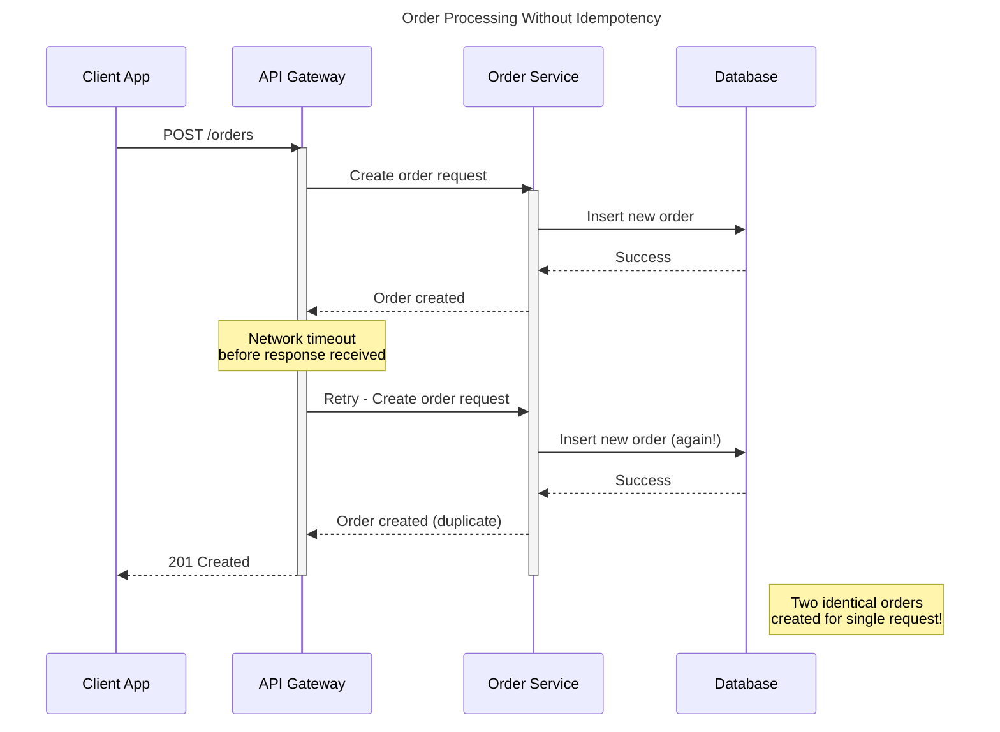
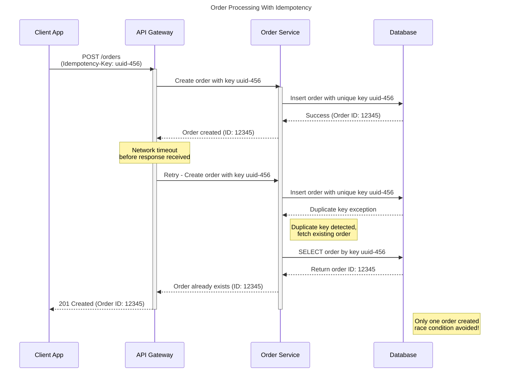

# Introduction

Imagine a scenario where you're transferring money from your bank account to another account. During the transfer, a network problem causes a timeout, and as a user, you click the "Transfer" button again. The second attempt succeeds, but to your horror, you discover your account has been debited twice for the same transaction. This unpleasant experience is exactly what API idempotency aims to prevent.

In distributed systems and APIs, idempotency ensures that multiple identical requests have the same effect as a single request. This property is crucial for building reliable systems, especially when handling financial transactions, order submissions, or any operation where duplicates could cause serious problems.

In this article, we'll explore how to properly implement idempotent APIs to safeguard your systems against unintended duplicate operations.

# Understanding Idempotency

## What Makes an API Idempotent?

An idempotent API exhibits several key characteristics:

1. **Same Outcome Guarantee**: Multiple identical requests produce the same state as a single request would have produced.
2. **Safe Repetition**: Requests can be safely repeated without causing unintended side effects. This means identical request should not change or add any additional behavior to the resource that previously touched or created. E.g If I request identical create payment API five times, then payment should only be created once.

## Idempotency by HTTP Method

HTTP methods have inherent idempotency properties:

| Method | Idempotent? | Notes |
|--------|-------------|-------|
| GET    | Yes         | Retrieving data has no side effects |
| HEAD   | Yes         | Similar to GET but returns only headers |
| OPTIONS| Yes         | Returns communication options |
| PUT    | Yes         | Replaces target resource with the request payload |
| DELETE | Yes         | Resource remains deleted after first successful call |
| POST   | No          | Generally creates new resources/entries with each call |
| PATCH  | No*         | Depends on the implementation (*can be made idempotent) |

Understanding these properties is essential for designing reliable APIs, especially in distributed systems where network failures and retries are common occurrences.

# Why Idempotency Matters

## Reliability in Unreliable Environments

Network failures are inevitable in distributed systems. Connections drop, requests timeout, and responses get lost. Without idempotency, each retry attempt could potentially:

- Create duplicate records
- Process payments multiple times
- Apply the same state change repeatedly

## Technical Implementation Challenges

To visualize the challenges of non-idempotent operations in distributed systems, consider this scenario:

With proper idempotency implementation, this scenario would be prevented:

These diagrams illustrate why idempotency is crucial for maintaining data integrity during network failures or client retries.

## Enhanced User Experience

When users encounter errors or timeouts, they often retry their actions. Idempotent APIs ensure that these retries don't lead to unintended consequences, maintaining user trust in your application.

## Data Consistency

In a system with non-idempotent operations, recovering from partial failures becomes extremely complicated. Idempotency simplifies error handling and recovery procedures, ensuring data remains consistent even after failures.

## Real-world Consequences

Consider these scenarios without idempotency:

- A payment gateway that processes the same charge multiple times
- An inventory system that decrements stock counts on each retry
- A shipping service that creates duplicate orders when network issues occur

The financial, operational, and reputational costs can be substantial.