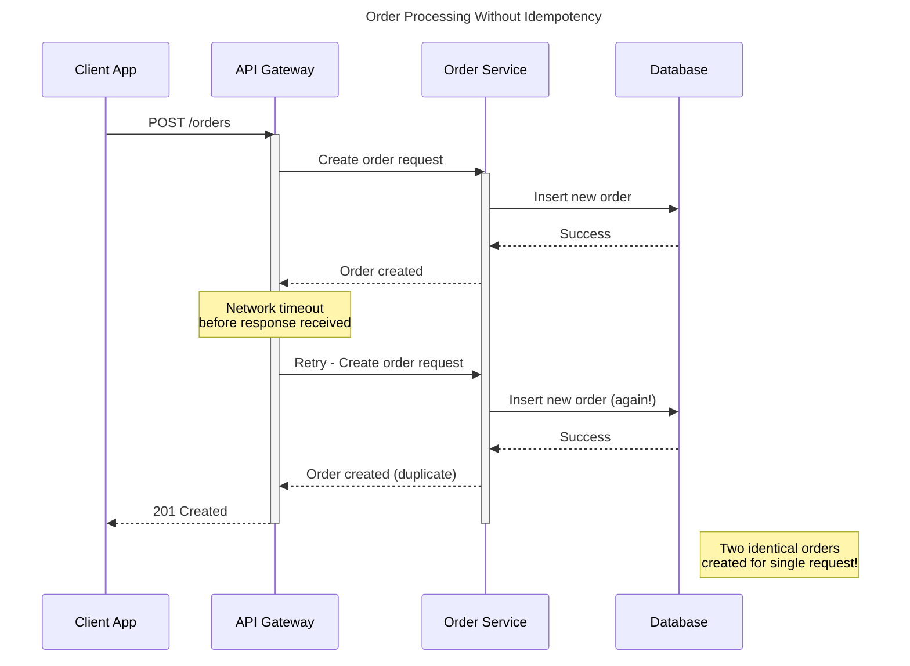
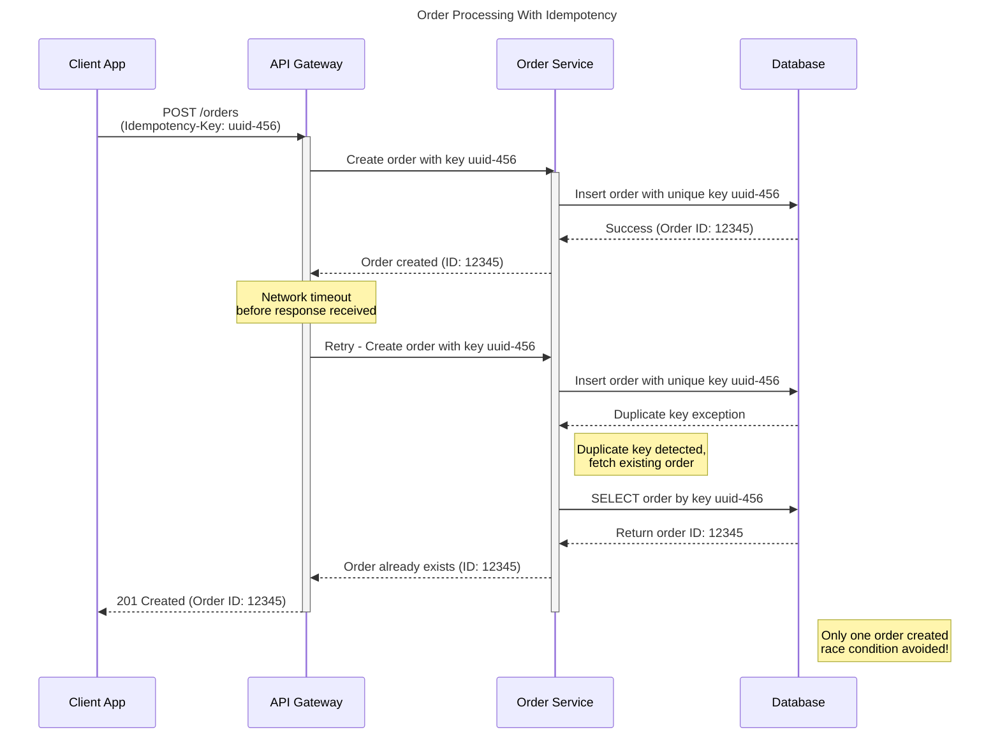

# Introduction

Imagine a scenario where you're transferring money from your bank account to another account. During the transfer, a network problem causes a timeout, and as a user, you click the "Transfer" button again. The second attempt succeeds, but to your horror, you discover your account has been debited twice for the same transaction. This unpleasant experience is exactly what API idempotency aims to prevent.

In distributed systems and APIs, idempotency ensures that multiple identical requests have the same effect as a single request. This property is crucial for building reliable systems, especially when handling financial transactions, order submissions, or any operation where duplicates could cause serious problems.

In this article, we'll explore how to properly implement idempotent APIs to safeguard your systems against unintended duplicate operations.

# Understanding Idempotency

## What Makes an API Idempotent?

An idempotent API exhibits several key characteristics:

1. **Same Outcome Guarantee**: Multiple identical requests produce the same state as a single request would have produced.
2. **Safe Repetition**: Requests can be safely repeated without causing unintended side effects. This means identical request should not change or add any additional behavior to the resource that previously touched or created. E.g If I request identical create payment API five times, then payment should only be created once.

## Idempotency by HTTP Method

HTTP methods have inherent idempotency properties:

| Method | Idempotent? | Notes |
|--------|-------------|-------|
| GET    | Yes         | Retrieving data has no side effects |
| HEAD   | Yes         | Similar to GET but returns only headers |
| OPTIONS| Yes         | Returns communication options |
| PUT    | Yes         | Replaces target resource with the request payload |
| DELETE | Yes         | Resource remains deleted after first successful call |
| POST   | No          | Generally creates new resources/entries with each call |
| PATCH  | No*         | Depends on the implementation (*can be made idempotent) |

Understanding these properties is essential for designing reliable APIs, especially in distributed systems where network failures and retries are common occurrences.

# Why Idempotency Matters

## Reliability in Unreliable Environments

Network failures are inevitable in distributed systems. Connections drop, requests timeout, and responses get lost. Without idempotency, each retry attempt could potentially:

- Create duplicate records
- Process payments multiple times
- Apply the same state change repeatedly

## Technical Implementation Challenges

To visualize the challenges of non-idempotent operations in distributed systems, consider this scenario:



With proper idempotency implementation, this scenario would be prevented:



These diagrams illustrate why idempotency is crucial for maintaining data integrity during network failures or client retries.

# Implementation Strategies 

## Using Idempotency Keys

When discussing "identical requests," we need a reliable mechanism to identify them. This is where idempotency keys come in.

An idempotency key is a unique identifier associated with a specific client request that allows the server to detect and handle duplicate requests properly. Here's how it works:

1. **Client Responsibility**: The client generates a unique idempotency key (typically a UUID with sufficient entropy to avoid collisions)
2. **Request Header**: The key is included in the request header, often as `Idempotency-Key` or `X-Idempotency-Key`
3. **Server Processing**: The server uses this key to determine if it's processing a new request or a retry of a previous request

Example request:
```
POST /api/payments HTTP/1.1
Host: example.com
Content-Type: application/json
Idempotency-Key: 123e4567-e89b-12d3-a456-426614174000

{
  "amount": 100.00,
  "currency": "USD",
  "destination": "account-456"
}
```

## When Should Clients Regenerate Idempotency Keys?

For user-facing APIs, idempotency key generation is typically guided by the application's user experience. If a create payment request consistently results in timeouts or server errors, redirecting the user to the payments dashboard allows them to verify whether the payment was created. If the payment does not appear in the dashboard after a reasonable delay, it is generally safe to generate a new idempotency key and retry the operation.
From an API system perspective, such as with Stripe's Create Payment API, the idempotency key is often derived from an internal identifier generated by your database and then passed in the Stripe API's idempotency key header. This approach ensures that the same key is used for all retries until the request succeeds.

# Approaches

In this section, I will give you some of the implementation approaches that I have found during my careers as software engineer. But before that I want to define API requirements and here I will simulate `POST /api/payments` API idempotency handling.

## API Requirements

1. The client must send a `POST /api/payments` request with both an idempotency key and an API key for authentication.
    ```
    POST /api/payments HTTP/1.1
    Host: example.com
    Content-Type: application/json
    Idempotency-Key: 123e4567-e89b-12d3-a456-426614174000
    Api-Key: Merchant-Server-Key-5fc07d0d-3469-46a7-9e76-029c1c4cb002
    Request Body
    {
      "amount": 100.00,
      "currency": "USD",
      "destination": "account-456"
    }

    Response
    {
        "payment_id": "payment-id-1"
    }
    ```
2. The API must allow clients to retry requests with the same idempotency key during network instability or server errors, ensuring no duplicate payments occur. Each identical request with the same idempotency key is processed as a single operation.
3. If a subsequent request arrives with the same idempotency key but a different payload or different user, the system must respond with HTTP 409 Conflict.
