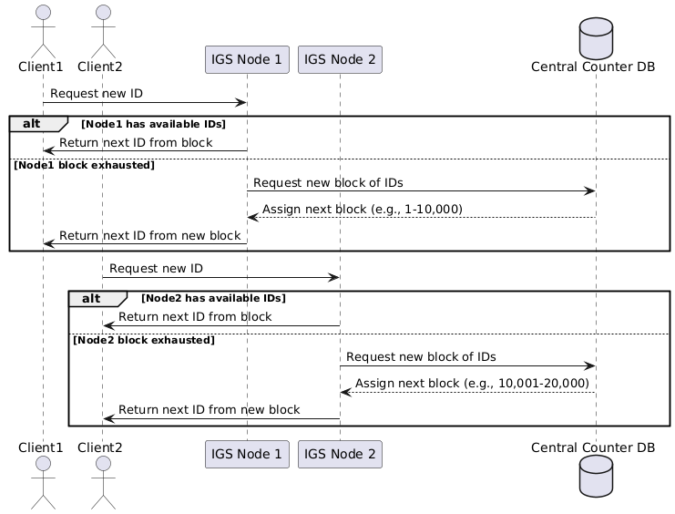

Designing robust and efficient ID generation strategies is a fundamental aspect of building scalable systems. In this article, I’ll walk you through several approaches to generating IDs, discuss their pros and cons, and highlight suitable use cases for each.

### Auto-Increment IDs in SQL Databases

A common starting point is leveraging auto-increment IDs provided by SQL databases like MySQL or PostgreSQL. Each time you insert a new record, the database automatically generates a unique, sequential ID. This approach is simple and efficient, especially since these IDs are indexed internally for fast lookups and joins.

However, auto-increment IDs can expose information about your system. For example, competitors might infer how many users or posts you have simply by observing the IDs. To mitigate this, you can obfuscate IDs using libraries like [Sqids](https://sqids.org/id), which transform numeric IDs into non-sequential strings. While not impossible to reverse-engineer, especially without knowledge of the salt or shuffled alphabet, this adds a layer of obscurity that’s often sufficient for most applications.

Alternatively, you can introduce a separate, randomly generated unique field—such as a UUID v4—for public-facing APIs. This prevents easy enumeration of your data. However, UUIDs are larger (128 bits) and can be less efficient for indexing, especially if stored as strings. To optimize, use native UUID types in PostgreSQL or `BINARY(16)` in MySQL, which improves storage and indexing performance.

### Scaling Beyond a Single SQL Node: Sharding

As your dataset grows, you may reach the limits of a single SQL node, whether due to storage constraints (e.g., AWS EC2’s 64 TB SSD limit) or write throughput (e.g., exceeding 10,000 writes per second for modern computer). At this point, sharding—splitting your data across multiple databases—becomes necessary.

Sharding can be implemented by assigning data ranges to different databases (range-based sharding) or by hashing IDs and distributing records based on the hash modulo the number of shards. However, using auto-increment IDs in a sharded environment introduces challenges, especially when adding or removing shards.

One workaround is to configure each shard with a custom auto-increment sequence. For example, with N shards, shard 1 starts at 1 and increments by N, shard 2 starts at 2, and so on. While simple, this approach becomes cumbersome if you need to adjust the number of shards.

A more flexible solution is to use UUID v4 for ID generation. You can hash the UUID and use the result to determine the appropriate shard. This sacrifices some storage efficiency but greatly simplifies sharding and rebalancing, especially when combined with consistent hashing to minimize data movement during scaling events.
### Time-Sortable IDs: ULID, Snowflake, and MongoDB ObjectId

While UUID v4 ensures uniqueness, it lacks inherent time-ordering, which can negatively impact index performance and make sorting by creation time less efficient. Time-sortable IDs solve this by embedding a timestamp component, ensuring that newly generated IDs are sequentially ordered. This is especially beneficial for workloads like timelines, event logs, or feeds, where recent entries are frequently queried in order. With time-sortable IDs, you can often avoid a separate `createdAt` field, simplifying your schema and saving storage.

Three widely used time-sortable ID schemes are ULID, Snowflake, and MongoDB ObjectId:

- **ULID** (Universally Unique Lexicographically Sortable Identifier) encodes a 48-bit millisecond timestamp and 80 bits of randomness. This design provides 2^80 (about 1.2 x 10^24) unique possibilities per millisecond, making collisions extremely unlikely. For example, even if you generate 1 million ULIDs per millisecond, the probability of a collision due to the birthday paradox remains vanishingly small. ULIDs are lexicographically sortable, so newer IDs always sort after older ones.
- **Snowflake**, developed by Twitter, generates 64-bit IDs by combining a timestamp, a machine/datacenter identifier, and a sequence number. This structure guarantees uniqueness and time-ordering across distributed systems. While Snowflake IDs can be affected by clock skew, this can be mitigated by using monotonic clocks and handling clock regressions gracefully.
- **MongoDB ObjectId** is a 12-byte identifier consisting of a 4-byte timestamp (seconds since epoch), a 5-byte random value (often derived from machine and process identifiers), and a 3-byte incrementing counter. ObjectIds are naturally time-sortable and provide uniqueness across distributed systems. The embedded timestamp also allows you to extract creation time directly from the ID, simplifying queries and reducing the need for a separate timestamp field.

By adopting time-sortable IDs like ULID, Snowflake, or MongoDB ObjectId, you gain efficient, scalable, and distributed-friendly identifiers that simplify data modeling and improve query performance for time-ordered data.

### Short IDs for URL Shorteners

For applications like URL shorteners (e.g., Bit.ly), generating compact, human-friendly IDs is crucial—typically 7–8 characters long. Using a base-62 character set (0–9, A–Z, a–z), a 7-character ID provides about 3.5 trillion unique combinations. While it might seem feasible to generate random IDs within this space, the risk of collisions increases rapidly due to the birthday paradox. For example, if we have 3.5 trillion possibilities, after generating just over 2 million random IDs, there's already a 50% chance of a collision—an issue that quickly becomes significant for popular services. In fact, you would be surprised that 90% of collisions happen at just 4 million ID generations. So it would be a waste of compute time to check if an ID already exists in the database before inserting it. To estimate collision probabilities for different ID lengths and volumes, you can use tools like [bdayprob.com](https://www.bdayprob.com/).

A straightforward solution is to use an auto-incrementing counter from a SQL database. This guarantees uniqueness and is simple to implement, as each new record receives the next available integer. The integer can then be encoded into a base-62 string to create the short URL. For many use cases, this approach is sufficient and efficient.

However, if your system needs to handle write throughput beyond what a single SQL node can support, a distributed ID Generation Service (IGS) becomes necessary. In this architecture, multiple IGS nodes each reserve blocks of IDs (e.g., 10,000 at a time) from a central counter database. Each node then hands out IDs from its reserved block, reducing contention on the central counter and allowing the system to scale horizontally.

**Example: Distributed IGS Node Allocation**

Suppose you have three IGS nodes (Node 1, Node 2, Node 3), and each reserves a block of 10,000 IDs from the central counter:

- **Node 1** requests a block and is assigned IDs 1–10,000. It hands out IDs sequentially from this range (e.g., 1, 2, 3, ...).
- **Node 2** requests the next block and is assigned IDs 10,001–20,000. It hands out IDs 10,001, 10,002, etc.
- **Node 3** requests a block and is assigned IDs 20,001–30,000, and so on.

When a node exhausts its current block, it requests a new block from the central counter (e.g., Node 1, after reaching 10,000, requests and receives 30,001–40,000).

This approach ensures that each IGS node can generate IDs independently and at high speed, while the central counter is only updated when a new block is reserved—minimizing database contention.

In summary, for moderate traffic, a SQL auto-increment counter works well. For high-throughput scenarios, a distributed IGS solution is preferred, as it reduces database contention and scales efficiently. In both cases, converting the numeric ID to a base-62 string yields the compact, collision-free short URLs required for services like Bit.ly.

---
### Step-by-Step Guide to Choosing an ID Generation Strategy

1. **Assess Your Requirements**
    - **Scalability:** Will your system need to handle high write throughput or scale across multiple nodes?
    - **Predictability:** Do you need IDs to be sequential, random, or obfuscated?
    - **Performance:** Are fast inserts and efficient indexing critical?
    - **ID Length & Format:** Do you need short, human-friendly IDs or is a longer, opaque format acceptable?
    - **Security:** Should IDs be hard to guess or enumerate?

2. **Start Simple for Small-Scale Systems**
    - Use **auto-increment IDs** in SQL databases for straightforward, single-node applications.
    - If exposing IDs externally, consider obfuscating them (e.g., with Sqids) or adding a public UUID field.

3. **Plan for Growth and Distribution**
    - For systems that may outgrow a single database node (either the data size or write throughput), avoid relying solely on auto-increment IDs since you would need to shard in order to meet the system growth.
    - Consider **UUID v4** for distributed uniqueness, but be aware of indexing and storage trade-offs.

4. **Enable Efficient Time-Ordering**
    - If you need to sort or query by creation time, use **time-sortable IDs** like ULID, Snowflake, or MongoDB ObjectId.
    - These IDs embed timestamps, improving index locality and query performance for time-based data.

5. **Optimize for Short, Human-Friendly IDs**
    - For use cases like URL shorteners, use a **base-62 encoded auto-increment counter** for compact, unique IDs.
    - For high throughput, implement a **distributed ID Generation Service** that allocates ID blocks to multiple nodes.

6. **Consider Sharding and Rebalancing**
    - When sharding, avoid simple auto-increment IDs unless you can coordinate sequences across shards.

7. **Review and Iterate**
    - Regularly revisit your ID strategy as your system evolves.
    - Monitor for bottlenecks, collisions, or security concerns, and adjust your approach as needed.

By following these steps and understanding the trade-offs, you can select an ID generation strategy that matches your system’s needs and supports future growth.
